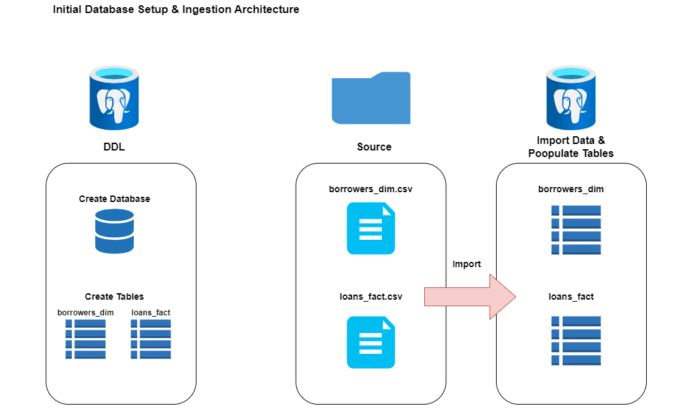
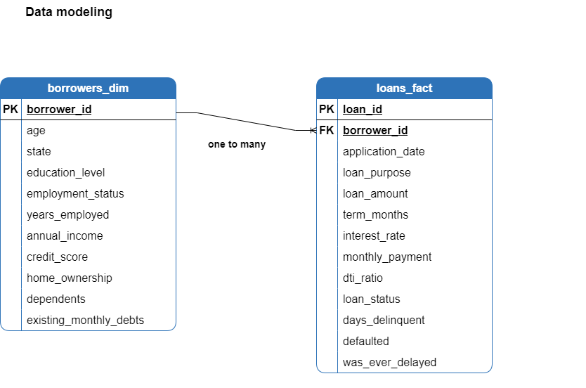

# Introduction

In this scenario the management of a mid-size consumer lending company is concerned about the rising default rate on personal loans.

The management wants data-driven insights about the factors driving the increase of default rate, recommendations about the underwriting policy to lower and maintain the default rate below the target of 10% and present a financial assessment of the proposed underwriting policy changes.


# Dataset

 As a data analyst of the company i have been provided with two csv files:

1. Borrower profiles with demographic and financial data of the applicants.

2. Application details from existing Loan Book.


# Goals

To address management's request i have structured a three phase process to identify, quantify and control default risk.

1. Explore the data and identify the key risk factors driving default rate increase.

2. Create a framework to quantify the risk.

3. Provide data driven recommendations about the underwriting policy to lower and maintain the default rate below the 10% target, including a financial assessment of the proposed policy changes. 


# My Tools for the Project

- **PostgreSQL :** Open source relational database for all data storage and querying.
- **pgAdmin** PostgreSQL GUI used to create tables and import source CSV files. 
- **VS Code :**  Code editor for writing and managing SQL scripts.
- **SQL :** Primary language for data exploration, analysis and manipulation. 
- **Git :** Version control for tracking code changes and project history.
- **GitHub :** Platform for hosting
  and sharing scripts and documentation.
- **Draw.io :** Visual documentation and diagram creation tool.


# Set Up & Data Preparation

1. Create the Database and the Tables and import the source csv files using pgAdmin's import tool. 
<br><br>


<br><br>
*Set up process (image created with draw.io).*
<br><br>
<br><br>

<br><br>
 *A star schema with one dimension table
(borrowers_dim) and one fact table
(loans_fact) joined on borrower_id.(image created with draw.io).*

For full field descriptions
see the [Data Dictionary](https://github.com/theodorosmalezidis/Loan_Default_Risk_Analysis/blob/main/Data_Dictionary.md).

2. Data Integrity Checks & Reporting View Creation

Before i explore and analyze the data i decided to create a View from the two tables as a 'reporting mart'.
This will make it easier to query and analyze the data without having to join the tables every time avoiding as possible complex queries.

- Validate primary keys before join and create VIEW

```sql
-- NULL check on primary keys

select 
    * 
from 
    borrowers_dim
where
    borrower_id is null;

select 
    *
from
    loans_fact
where
    loan_id is null;


-- Duplicate check on primary keys

select 
      borrower_id  
    , count(*) as duplicates
from
    borrowers_dim
group by
    borrower_id
having
    count(*) > 1
order by
    duplicates desc;

select 
      loan_id  
    , count(*) as duplicates
from
    loans_fact
group by
    loan_id
having
    count(*) > 1
order by
    duplicates desc;
```

No nulls and no duplicates, primary keys are clean — safe to create the view.

- Create View

```sql
drop view if exists loan_default_risk;

create view loan_default_risk as 

select
      b.borrower_id
    , b.age
    , b.state
    , b.education_level
    , b.employment_status
    , b.years_employed
    , b.annual_income
    , b.credit_score
    , b.home_ownership
    , b.dependents
    , b.existing_monthly_debt
    , l.loan_id
    , l.application_date
    , l.loan_purpose
    , l.loan_amount
    , l.term_months
    , l.interest_rate
    , l.monthly_payment
    , l.dti_ratio
    , l.loan_status
    , l.days_delinquent
    , l.defaulted
    , l.was_ever_delayed
      -- create a risk category column in specific buckets based on loan status and days delinquent
    , case   
        when l.loan_status='Paid Off'  then 'Closed'
        when l.days_delinquent > 90 then 'Defaulted'
        when l.days_delinquent = 0 then 'Performing'
        when l.days_delinquent between 1 and 30 then 'Low Risk'
        when l.days_delinquent between 31 and 90 then 'High Risk'
        else 'Unknown'
      end as risk_category

from
    borrowers_dim b
        join loans_fact l
            on b.borrower_id = l.borrower_id;
```
With the reporting view in place the analysis can begin.


#  Loan Default Risk Assessment & Underwriting Strategy


## 1. Explore the data and identify the key risk factors driving default rate increase.

Calculate total unique borrowers

```sql
select
     count(distinct borrower_id) as total_unique_borrowers
from
    loan_default_risk;
```
Result

|total_unique_borrowers|
|----------------------|
|500|

Calculate total number of loans originated

```sql
select
     count(distinct loan_id) as total_loans
from
    loan_default_risk;
```
Result

|total_loans|
|----------------------|
|601|

So multiple loans for some borrowers. Let's calculate the distribution of loans per borrower.

```sql
with borrower_loan_counts as (

    select
          borrower_id
        , count(*) as loan_count
    from
        loan_default_risk
    group by
        borrower_id
)
select
      loan_count
    , count(*) as total_borrowers
from
    borrower_loan_counts
group by
    loan_count
order by
    loan_count desc;
```

Result

|loan_count|total_borrowers|
|-----------|---------------|
|1          |399            |
|2          |101            |

Calculate default rate for two categories of borrowers, with one and multiple loans.

```sql
with borrowers_stats as(
    select 
        borrower_id
      , count(*) as total_loan_count
      ,max(defaulted) as has_ever_defaulted-- 1 if defaulted in any loan, 0 otherwise
    from
      loan_default_risk
    group by
        borrower_id   
)

select 
    case    
      when total_loan_count=1 then 'Single Loan' else 'Multiple Loans' end as borrower_category
  , count(*) as total_borrowers
  , sum(has_ever_defaulted) total_defaulted
  , cast(sum(has_ever_defaulted)*100.0/count(*) as decimal (10,2)) as default_rate
from 
  borrowers_stats
group by 
  1;
```

Result

|borrower_category|total_borrowers|total_defaulted|default_rate|
|-----------|---------------|---------------------|-----------|
|Single Loan    |399            |61               |15.29%      |
|Multiple Loans |101            |22               |21.78%     |

So multiple loan borrowers default rate at 21.78% vs 15.29% for single loan borrowers a gap of 6.49. *Noted as finding.*

Calculate loan book default rate and difference to target default rate(10%).

```sql
select 
      count(*) as total_loans
    , sum(defaulted) as total_defaults
    , cast(sum(defaulted)*100.0/count(*) as decimal(10,2)) as default_rate
    , cast(sum(defaulted)*100.0/count(*) as decimal(10,2))-10.0 as diff_vs_target
from
    loan_default_risk;
```
Results

|total_loans|total_defaults|default_rate|diff_vs_target|
|-----------|---------------|---------------------|-----------|
|601   |85           |14.14               |4.14     |

The loan book is running 4.14 points above the 10% target. The next step is to identify which factors are driving this elevated rate.

But before that i want to make sure that are not any null values that will mess up my calculations so i will run a query to see if there any of the factors i will analyze have any null values.

```sql

select 
      sum(case when loan_purpose is null then 1 else 0 end) as loan_purpose_nulls
    , sum(case when home_ownership is null then 1 else 0 end) as home_ownership_nulls
    , sum(case when employment_status is null then 1 else 0 end) as employment_status_nulls
    , sum(case when annual_income is null then 1 else 0 end) as annual_income_nulls
    , sum(case when credit_score is null then 1 else 0 end) as credit_score_nulls
    , sum(case when interest_rate is null then 1 else 0 end) as interest_rate_nulls
    , sum(case when dti_ratio is null then 1 else 0 end) as dti_ratio_nulls
    , sum(case when defaulted is null then 1 else 0 end) as defaulted_nulls
from
    loan_default_risk;
```
All columns return zero nulls — analysis columns are clean.

In this query I will analyze 7 of the factors most likely to explain the increase in default rate across the loan book and calculate the spread between the max and min of default rate amongst each factor's segments. 

This way by finding the ones with the biggest spread i will be identifying the key risk factors that drive the default rate increase.

```sql
with default_rate_data as(   --creating a cte to calculate default rates for each factor and category, and filter out buckets with less than 10 loans to ensure statistical significance.


    select 
          'Loan Purpose' as factor
        , loan_purpose as category
        , count(*) as loan_volume
        , cast(sum(defaulted)*100.0/count(*) as decimal(10,2)) as default_rate
    from 
        loan_default_risk
    group by 
          1
        , 2
    having count(*)>=10 --  minimum 10 loans per bucket to ensure statistically meaningful default rates

    union all

    select 
          'Home Ownership' as factor
        , home_ownership as category
        , count(*) as loan_volume
        , cast(sum(defaulted)*100.0/count(*) as decimal(10,2)) as default_rate
    from 
        loan_default_risk
    group by 
          1
        , 2
    having count(*)>=10

    union all

    select 
          'Employment Status' as factor
        , employment_status as category
        , count(*) as loan_volume
        , cast(sum(defaulted)*100.0/count(*) as decimal(10,2)) as default_rate
    from 
        loan_default_risk
    group by 
          1
        , 2
    having count(*)>=10

    union all

    select 
          'Credit Score' as factor
        , case 
            when credit_score < 600 then '<600'
            when credit_score between 600 and 649 then '600-649'
            when credit_score between 650 and 699 then '650-699'
            when credit_score between 700 and 749 then '700-749'
            else '>=750' end as category
        , count(*) as loan_volume
        , cast(sum(defaulted)*100.0/count(*) as decimal(10,2)) as default_rate
     from 
        loan_default_risk
    group by 
          1
        , 2
    having count(*)>=10
    
    union all

    select 
          'Annual Income' as factor
        , case 
            when annual_income < 40000 then '<40000'
            when annual_income between 40000 and 69999 then '40000-69999'
            when annual_income between 70000 and 99999 then '70000-99999'
            when annual_income between 100000 and 129999 then '100000-129999'
            else '130000+' end as category
        , count(*) as loan_volume
        , cast(sum(defaulted)*100.0/count(*) as decimal(10,2)) as default_rate
     from 
        loan_default_risk
    group by 
          1
        , 2
    having count(*)>=10

  union all

    select 
          'dti Ratio' as factor
        , case 
            when dti_ratio < 20 then '<20'
            when dti_ratio between 20 and 34 then '20-34'
            when dti_ratio between 35 and 49 then '35-49'
            else '>=50' end as category
        , count(*) as loan_volume
        , cast(sum(defaulted)*100.0/count(*) as decimal(10,2)) as default_rate
     from 
        loan_default_risk
    group by 
          1
        , 2
    having count(*)>=10

  union all

    select 
          'Interest Rate' as factor
        , case 
            when interest_rate < 7.5 then '<7.5'
            when interest_rate between 7.5 and 9.99 then '7.5-9.99'
            when interest_rate between 10 and 12.49 then '10-12.49'
            else '>12.5' end as category
        , count(*) as loan_volume
        , cast(sum(defaulted)*100.0/count(*) as decimal(10,2)) as default_rate
     from 
        loan_default_risk
    group by 
          1
        , 2
    having count(*)>=10

)   


select 
      factor
    , min(default_rate) as min_rate
    , max(default_rate) as max_rate
    , max(default_rate)-min(default_rate) as spread
from
    default_rate_data
group by
    factor
order by
    spread desc;
```

Result

|factor           |min_rate      |max_rate    |spread     |
|-----------------|--------------|------------|-----------|
|Credit Score     |6.98          |27.59       |20.61      |
|Interest Rate    |8.24          |24.63       |16.39      |
|dti Ratio        |6.40          |21.50       |15.10      |
|Loan Purpose     |9.80          |21.43       |11.63      |
|Home Ownership   |9.30          |19.05       |9.75       |
|Employment Status|10.61         |20.00       |9.39       |
|Annual Income    |12.33         |15.23       |2.90       |

The top 3 factors by default rate spread a)Credit Score b)Interest Rate c)dti Ratio show a clear gap vs the remaining 4 (all below 12 points).
Worth mentioning that Annual Income had the lowest spread between its segments showing minimal contribution to the total default rate of loan book (likely already captured by DTI).


Next step is to drill down more to isolate the top bucket with the highest default rate from each of the top 3 factors we have identified.

```sql
with top_factors as(-- cte to create buckets in each of those factors and union all in one table

  select 
        'Credit Score' as factor
      , case 
          when credit_score <600 then '<600'
          when credit_score between 600 and 649 then '600-649'
          when credit_score between 650 and 699 then '650-699'
          when credit_score between 700 and 749 then '700-749'
          else '>=750' end as category
      , count(*) as loan_volume
      , cast(sum(defaulted)*100.0/count(*) as decimal(10,2)) as default_rate
  from 
      loan_default_risk
  group by 
        1
      , 2
  having
      count(*)>=10

  union all

  select 
          'Interest Rate' as factor
      , case 
          when interest_rate <7.5 then '<7.5'
          when interest_rate between 7.5 and 9.99 then '7.5-9.99'
          when interest_rate between 10 and 12.49 then '10-12.49'
          else '>=12.5' end as category
      , count(*) as loan_volume
      , cast(sum(defaulted)*100.0/count(*) as decimal(10,2)) as default_rate
  from 
      loan_default_risk
  group by 
        1
      , 2
  having 
      count(*)>=10

  union all

  select 
        'dti Ratio' as factor
      , case 
          when dti_ratio <20 then '<20'
          when dti_ratio between 20 and 34 then '20-34'
          when dti_ratio between 35 and 49 then '35-49'
          else '>=50' end as category
      , count(*) as loan_volume
      , cast(sum(defaulted)*100.0/count(*) as decimal(10,2)) as default_rate
  from 
      loan_default_risk
  group by 
        1
      , 2
  having
      count(*)>=10
)
,
ranking as( -- cte to rank the categories in each factor by default rate

  select
      factor 
    , category
    , loan_volume
    , default_rate
    , rank() over(partition by factor order by default_rate desc) as dr_rank
  from 
    top_factors
)

select -- final query to find top bucket with highest default rate in each factor
    factor 
  , category
  , loan_volume
  , default_rate
from
  ranking
where
  dr_rank=1
```

Results

|factor           |category      |loan_volume |default_rate|
|-----------------|--------------|------------|------------|
|Credit Score     |<600          |116         |27.59       |
|dti Ratio        |>=50          |294         |18.71       |
|Interest Rate    |>=12.5        |134         |24.63       |

Those highest default rate buckets in each factor will be used as the thresholds for the risk framework that follows in the next phase.

## 2. Create a framework to quantify the risk.

Using the three thresholds identified in Phase 1, each loan is assigned a risk score from 0 to 3 based on how many flags it triggers. This creates a simple but powerful framework to quantify and tier the default risk across the portfolio.


```sql
with risk_scoreboard as ( -- CTE to calculate the risk score for each loan based on the three highest-default buckets identified in the factor analysis above.

    SELECT 
          CASE WHEN credit_score  <  600  THEN 1 ELSE 0 END +
          CASE WHEN interest_rate >= 12.5 THEN 1 ELSE 0 END +
          CASE WHEN dti_ratio     >= 50   THEN 1 ELSE 0 END  AS risk_score
        , defaulted
    FROM loan_default_risk

)

select 
      risk_score
    , count(*) as total_loans
    , sum(defaulted) as total_defaults
    , cast(sum(defaulted)*100.0/count(*) as decimal(10,2)) as default_rate
    , cast(count(*)*100.0/sum(count(*)) over() as decimal(10,2)) as pct_of_portfolio
    , cast(sum(defaulted)*100.0/sum(sum(defaulted)) over() as decimal(10,2)) as pct_of_all_defaults
    /*next metric quantifies how much riskier these borrowers are relative to the average borrower in the portfolio. 
    It compares the default rate of each risk score bucket to the overall default rate of the entire portfolio, 
    showing how much more likely is a loan in this risk score to default compared to the average loan in the portfolio(most important metric ) */
    , cast((sum(defaulted)*100.0/count(*))/((sum(sum(defaulted)) over ()*100.0/sum(count(*)) over())) as decimal(10,2)) as risk_ratio 
from 
    risk_scoreboard
group by
    risk_score
order by
    default_rate desc;
```
Results

| risk_score | total_loans | total_defaults | default_rate | pct_of_portfolio | pct_of_all_defaults | risk_ratio |
|------------|-------------|----------------|--------------|------------------|---------------------|------------|
| 3          | 47          | 19             | 40.43%       | 7.82%            | 22.35%              | 2.86x      |
| 2          | 81          | 20             | 24.69%       | 13.48%           | 23.53%              | 1.75x      |
| 1          | 217         | 23             | 10.60%       | 36.11%           | 27.06%              | 0.75x      |
| 0          | 256         | 23             | 8.98%        | 42.60%           | 27.06%              | 0.64x      |


**risk_score:**  Risk tier assigned to each loan based on how many of the three high-risk thresholds it breaches. Ranges from 0 to 3.

**total_loans:** Nr. of loans in that risk tier.

**total_defaults:** Nr. of defaulted loans in that risk tier.

**default_rate:** Default rate within that specific risk tier.

**pct_of_portfolio:** Percentage of total loans in that specific risk tier.

**pct_of_all_defaults:** Percentage of total portfolio defaults in that specific risk tier.

**risk_ratio:** The most important metric. Compares the default rate of each tier
to the portfolio average. Quantifies how many times more likely is a loan in this risk score to default compared to the average loan in the portfolio.

The results show that borrowers who fall into all three thresholds (risk score 3) are 2.86x more likely to default compared to the average loan in the firm's book, and 1.75x for risk score 2. The other two risk tiers are both below the portfolio average default rate.

The scoreboard measures the risk. The following query compares the average values of the three key factors across the portfolio and the 2 risk tiers to explain the risk. It can also be a confirmation of the scoreboard purpose to capture riskier borrowers. Together those two queries quantify the risk.

```sql
select 
      'Portfolio' as segment
    ,  cast(avg(credit_score) as decimal (10,2)) as avg_credit_score
    , cast(avg(interest_rate) as decimal (10,2))as avg_interest_rate
    , cast(avg(dti_ratio) as decimal (10,2))as avg_dti_ratio
from 
    loan_default_risk

union all 

select 
      'Risk Score 3' as segment
    , cast(avg(credit_score) as decimal (10,2)) as avg_credit_score
    , cast(avg(interest_rate) as decimal (10,2))as avg_interest_rate
    , cast(avg(dti_ratio) as decimal (10,2))as avg_dti_ratio
from 
    loan_default_risk
where
    case when credit_score  <  600  then 1 else 0 end +
    case when interest_rate >= 12.5 then 1 else 0 end +
    case when dti_ratio     >  50   then 1 else 0 end = 3

union all 

select 
      'Risk Score 2' as segment
    , cast(avg(credit_score) as decimal (10,2)) as avg_credit_score
    , cast(avg(interest_rate) as decimal (10,2))as avg_interest_rate
    , cast(avg(dti_ratio) as decimal (10,2))as avg_dti_ratio
from 
    loan_default_risk
where
    case when credit_score  <  600  then 1 else 0 end +
    case when interest_rate >= 12.5 then 1 else 0 end +
    case when dti_ratio     >=  50   then 1 else 0 end = 2
```

Results


| segment      | avg_credit_score | avg_interest_rate | avg_dti_ratio |
|--------------|------------------|-------------------|---------------|
| Portfolio    | 705.75           | 10.64%            | 49.68%        |
| Risk Score 3 | 569.34           | 14.05%            | 74.13%        |
| Risk Score 2 | 594.49           | 13.00%            | 56.12%        |

The results are a solid justification that the risk score 3 borrowers show dramatically worse fundamentals: credit score 136 points below portfolio average, DTI 24 points above and interest rate 3.4 points higher, and actually confirming the scorecard captures genuinely riskier borrowers and not statistical noise.

## Part 3 - Recommendations & Financial Assessment of New Policy

In this final phase i will translate the risk quantification to a new underwriting policy comparing it with the current one and project the potential financial impact to the company's profitability.

The following table (Table 1) has the results from the framework i built in phase 2 to quantify and tier the default risk across the portfolio.

| risk_score | total_loans | total_defaults | default_rate | pct_of_portfolio | pct_of_all_defaults | risk_ratio |
|------------|-------------|----------------|--------------|------------------|---------------------|------------|
| 3          | 47          | 19             | 40.43%       | 7.82%            | 22.35%              | 2.86x      |
| 2          | 81          | 20             | 24.69%       | 13.48%           | 23.53%              | 1.75x      |
| 1          | 217         | 23             | 10.60%       | 36.11%           | 27.06%              | 0.75x      |
| 0          | 256         | 23             | 8.98%        | 42.60%           | 27.06%              | 0.64x      |

I focus on the tiers with risk score 2 and 3, where the risk ratio (compares the default rate of each tier
to the portfolio average) is 1.75x and 2.86x respectively. The total loans of these two tiers are 128 and represent 21.29% of total loan book.


## New Underwriting Policy 

- Immediately decline all applications triggering a Risk Score of 3 (those failing all three thresholds: Credit Score < 600, DTI > 50, and Interest Rate >= 12.5%).
- Applications with a Risk Score of 2 must be manually reviewed.


```sql
select
      count(*) as remaining_loans                                                  
    , sum(defaulted) as remaining_defaults                                             
    , cast(sum(defaulted)*100.0/count(*) as decimal(10,2)) as new_default_rate                                    
    , 14.14 - cast(sum(defaulted)*100.0/count(*) as decimal(10,2))  as improvement                                
from
    loan_default_risk
where
    case when credit_score < 600  then 1 else 0 end +
    case when interest_rate >= 12.5 then 1 else 0 end +
    case when dti_ratio >= 50 then 1 else 0 end < 3;
```

Results

| remaining_loans | remaining_defaults | new_default_rate | improvement |
|------------|-------------|----------------|--------------|
| 554         | 66         | 11.91%            | 2.23      |


By applying that policy to current loan book the total default rate improves by 2.23 points and drops to 11.91% by rejecting only 7.82% of the applicants (Data from Table 1). A notable improvement but yet above the target of 10%.

- A more aggressive approach is to decline all applications triggering a Risk Score of 3 and 2.

```sql
select
      count(*) as remaining_loans                                                  
    , sum(defaulted) as remaining_defaults                                             
    , cast(sum(defaulted)*100.0/count(*) as decimal(10,2)) as new_default_rate                                    
    , 14.14 - cast(sum(defaulted)*100.0/count(*) as decimal(10,2)) as improvement                                
from
    loan_default_risk
where
    case when credit_score < 600  then 1 else 0 end +
    case when interest_rate >= 12.5 then 1 else 0 end +
    case when dti_ratio > 50 then 1 else 0 end < 2;
```

Results

| remaining_loans | remaining_defaults | new_default_rate | improvement |
|------------|-------------|----------------|--------------|
| 473         | 46        | 9.73%       | 4.41     |

By applying that policy to current loan book the total default rate improves by 4.41 points and drops to 9.73% - below the target of default rate, by rejecting 21.3% of the applicants (Data from Table 1). 
But i have to prove that this aggressive approach has a benefit to the company's financials.

I will do that by comparing the NII for existing loan book applying current Underwriting Policy vs recommended,
where NII (Net Interest Income) = Interest Revenue - Principal Losses and Interest Revenue = (Term Months * Monthly Payments) - Loan Amount.

```sql
-- Calculate Loan Book Numbers with current Underwriting Policy

select 
      'Current Policy' as policy
    , count(*) as total_loans
    , cast(sum(case when defaulted=0 then (term_months*monthly_payment)-loan_amount else 0 end) as decimal (10,2)) as interest_revenue
    , cast(sum(case when defaulted=1 then (loan_amount) else 0 end) as decimal (10,2)) as principal_lost
    , sum(case when defaulted=0 then (term_months*monthly_payment)-loan_amount else 0 end)-sum(case when defaulted=1 then (loan_amount) else 0 end) as nii
from 
    loan_default_risk

union all 

-- Calculate Loan Book Numbers with recommended Underwriting Policy

select 
      'New Policy' as policy
    , count(*) as total_loans
    , cast(sum(case when defaulted=0 then (term_months*monthly_payment)-loan_amount else 0 end) as decimal (10,2)) as interest_revenue
    , cast(sum(case when defaulted=1 then (loan_amount) else 0 end) as decimal (10,2)) as principal_lost
    , sum(case when defaulted=0 then (term_months*monthly_payment)-loan_amount else 0 end)-sum(case when defaulted=1 then (loan_amount) else 0 end) as nii
from 
    loan_default_risk
where 
    case when credit_score < 600  then 1 else 0 end +
    case when interest_rate >= 12.5 then 1 else 0 end +
    case when dti_ratio > 50 then 1 else 0 end < 2;
```
Results

| policy         | total_loans | interest_revenue | principal_lost | nii        |
|----------------|-------------|------------------|----------------|------------|
| Current Policy | 601         | 1984755.08       | 1824600.00     | 160155.08  |
| New Policy     | 473         | 1540518.36       | 977900.00      | 562618.36  |


So the outcome of two policies side by side with differences in Table 2:


| Metric            | Current Policy | New Policy      | Difference |
|-------------------|----------------|-----------------|------------|
| Total Loans       | 601            | 473             | -128       |
| Interest Revenue  | $ 1,984,755.08 | $ 1,540,518.36  | -22.38%    |
| Principal Lost    | $ 1,824,600.00 | $ 977,900.00    | -46.40%    |
| NII               | $ 160,155.08   | $ 562,618.36    | +251.29%   |


## Conclusion

The recommended new Underwriting Policy of declining risk 2 and risk 3 applications reduces Principal Losses by 46.4%, at a cost of 22.38% Interest Revenue - delivering an increase of 251.29% in Net Interest Income while bringing the Loan Book's total Default Rate to 9.73% below the 10% target.
